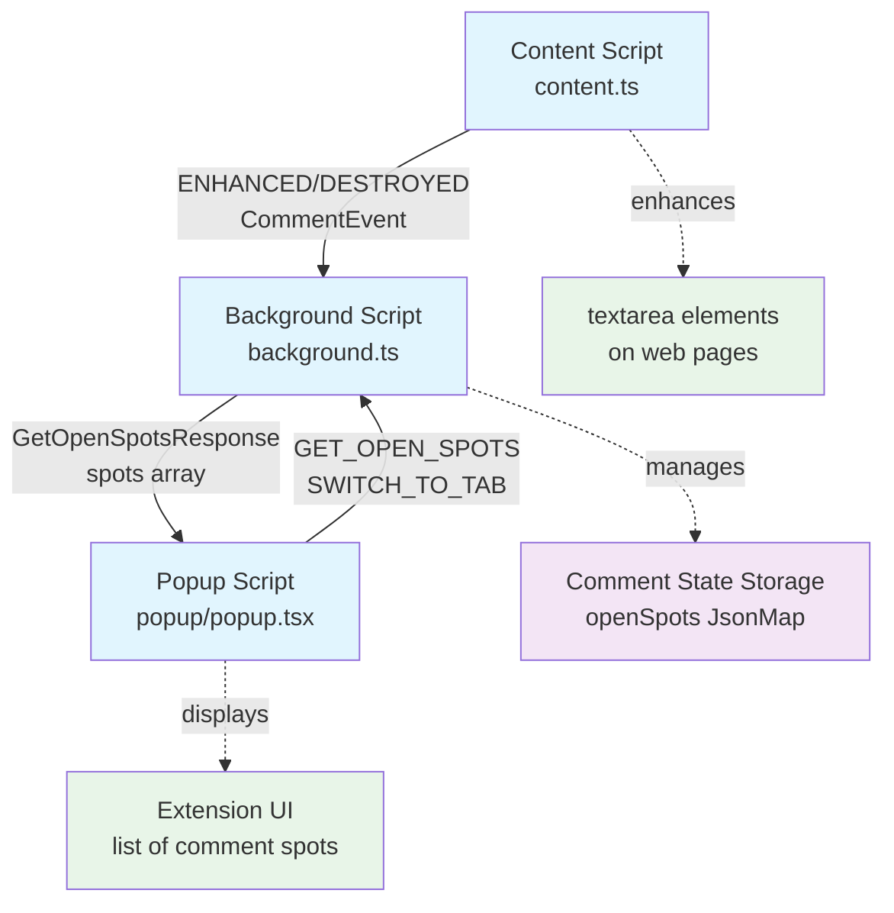

# Contributing

Thanks for your interest in contributing!

## Licensing of contributions

By submitting a Pull Request, you agree that your contributions are licensed under the same license as this project (Apache 2.0) and that you have the rights necessary to make this contribution.

## Privacy & security

This extension ***must never transmit any data outside the browser***.

- it adds syntax highlighting by running local scripts
- it stores finished and unfinished comments in local storage
- there is no need to initiate an outbound network request, no features will be added which require outbound network requests

## Developer quickstart

- `pnpm install`
- to update the popup:
  - `pnpm playground` gives react hotreload environment
- to improve comment detection and metadata extraction:
  - `pnpm corpus` gives dev environment for gitcasso's behavior on specific pages and page states
- to open a PR:
  - `pnpm precommit` fixes formatting and lints (biome), runs typechecking and tests
  - no worries if some intermediate commits don't pass
- to run the entire end-to-end browser extension with [WXT](https://wxt.dev/) hotreload:
  - `pnpm dev`
  - open [`chrome://extensions`](chrome://extensions)
  - toggle **Developer mode** (top-right)
  - click "Load unpacked" (far left)
    - `.output/chrome-mv3-dev`
    - if you can't find `.output`, it's probably hidden, `command+shift+period` will show it
  - click the puzzle icon next to the url bar, then pin the Gitcasso icon

## How it works

This is a [WXT](https://wxt.dev/)-based browser extension that

- finds `textarea` components and decorates them with [overtype](https://overtype.dev/) and [highlight.js](https://highlightjs.org/)
- stores unposted comment drafts, and makes them easy to find via the extension popup

### Entry points

- [`src/entrypoints/content.ts`](src/entrypoints/content.ts) - injected into every webpage
- [`src/entrypoints/background.ts`](src/entrypoints/background.ts) - service worker that manages state and handles messages
- [`src/entrypoints/popup/popup.tsx`](src/entrypoints/popup/popup.tsx) - popup (react html + TailwindCSS)

Every time a `textarea` shows up on a page, on initial load or later on, it gets passed to a list of `CommentEnhancer`s. Each one gets a turn to say "I can enhance this box!". They show that they can enhance it by returning something non-null in the method `tryToEnhance(textarea: HTMLTextAreaElement): Spot | null`. Later on, that same `Spot` data will be used by the `tableRow(spot: Spot): ReactNode` method to create React components for rich formatting in the popup table.

Those `Spot` values get bundled up with the `HTMLTextAreaElement` itself into an `EnhancedTextarea`, which gets added to the `TextareaRegistry`. At some interval, draft edits get saved by the browser extension.

When the `textarea` gets removed from the page, the `TextareaRegistry` is notified so that the `CommentSpot` can be marked as abandoned or submitted as appropriate.

## Test corpus

We maintain a corpus of test pages in two formats for testing the browser extension:
- `html` created by the [SingleFile](https://chromewebstore.google.com/detail/singlefile/mpiodijhokgodhhofbcjdecpffjipkle) browser extension
  - allows snapshotting the DOM at an intermediate step in the user's experience
  - most interactivity will be broken
- `har` recording of all network traffic of an initial pageload
  - limited to initial page load, but most interactivity will work

This corpus of pages is used to power snapshot tests and interactive dev environments.

### Viewing corpus

- **DISABLE GITCASSO IN YOUR BROWSER!!**
- Run `pnpm corpus` to start the test server at http://localhost:3001
- Select any corpus file to view in two modes:
  - **Clean**: Original unaltered page
  - **Gitcasso**: Page with extension injected for testing
    - it shows all data Gitcasso is extracting (if any)
    - click the rebuild button to test changes to the Gitcasso source

### Unit testing against corpus

- `gh-detection.test.ts` does snapshot testing on the data which gitcasso extracts
- `gh-ui.test.ts` does snapshot testing on the popup table decoration for all data extracted from the snapshots

### Adding HTML to the corpus (Manual)

- For testing post-interaction states (e.g., expanded textareas, modal dialogs, dynamic content)
- HTML snapshots live in `tests/corpus/*.html`, manually captured using SingleFile
- how-to
  1. Navigate to the desired page state (click buttons, expand textareas, etc.)
  2. Use SingleFile browser extension to save the complete page
  3. Save the `.html` file to `tests/corpus/` with a descriptive slug
  4. Add an entry to `tests/corpus/_corpus-index.ts` with `type: 'html'` and a description of the captured state
  5. Feel free to contribute these if you want, but be mindful that they will be part of our immutable git history

### Adding HAR to the corpus (Automated)

- For testing initial page loads and network requests
- HAR recordings live in `tests/corpus/*.har`, complete recordings of the network requests of a single page load
- how-to
  - update `tests/corpus/_corpus-index.ts` with a descriptive slug and URL which you want to add
  - `npx playwright codegen https://github.com/login --save-storage=playwright/.auth/gh.json` will store new auth tokens
    - login manually, then close the browser
    - ***these cookies are very sensitive! we only run this script using a test account that has no permissions or memberships to anything, recommend you do the same!***
  - `pnpm corpus:har:record {slug}` records new HAR files using those auth tokens (it needs args, run it with no args for docs)
    - **CONTRIBUTING THESE IS RISKY!**
    - we try to sanitize these (see `corpus-har-record.ts` for details) but there may be important PII in them, which is why we only use a test account
