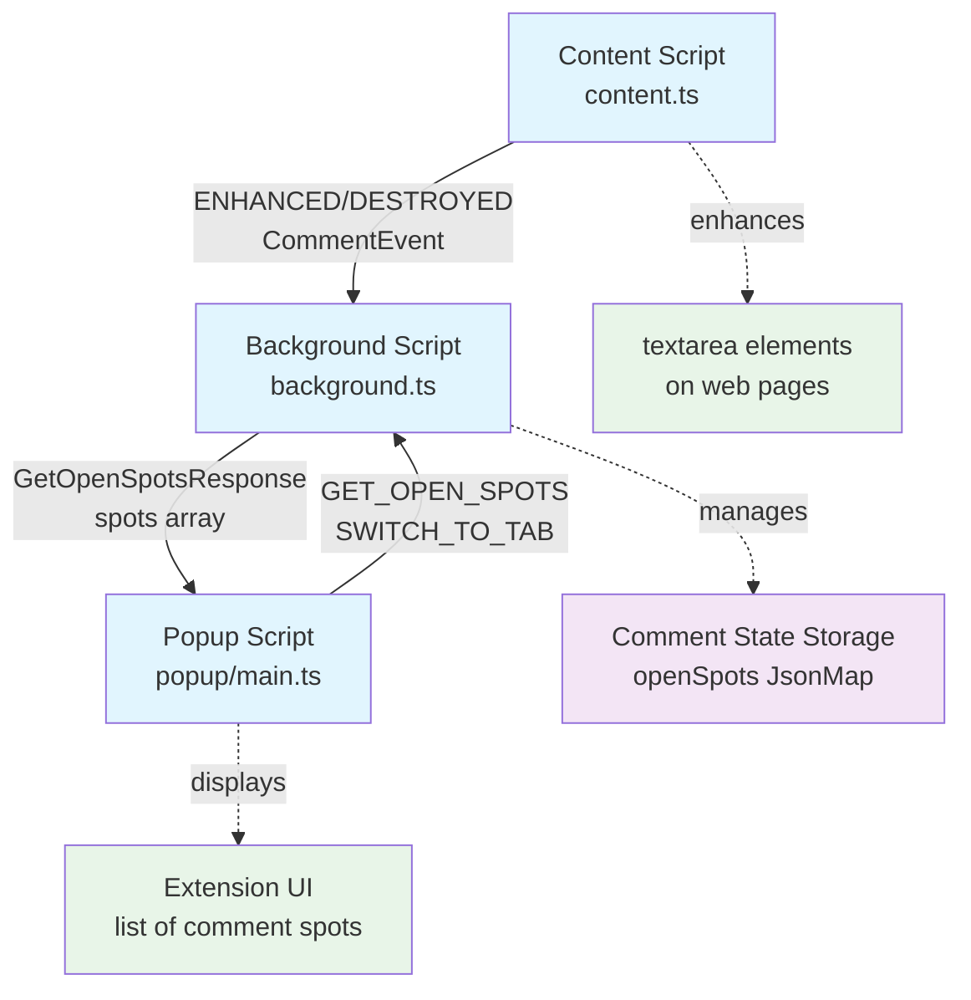

# Gitcasso browser extension

## Developer quickstart

### Hotreload development

- `pnpm install`
- `pnpm run dev`
- open [`chrome://extensions`](chrome://extensions)
- toggle **Developer mode** (top-right)
- click "Load unpacked" (far left)
  - `browser-extension/.output/chrome-mv3-dev`
  - if you can't find `.output`, it's probably hidden, `command+shift+period` will show it
- click the puzzle icon next to the url bar, then pin the Gitcasso icon

### Testing and quality
- `pnpm run biome` - runs `biome check` (lint & formatting)
- `pnpm run biome:fix` - fixes most of what `biome check` finds
- `pnpm run compile` - typechecking
- `pnpm test` - vitest
- `pnpm test -- -u` updates all the snapshots

### Deployment
- `pnpm run build` - build for mv3 for most browsers
- `pnpm run build:firefox` - build mv2 specifically for Firefox

## How it works

This is a [WXT](https://wxt.dev/)-based browser extension that

- finds `textarea` components and decorates them with [overtype](https://overtype.dev/) and [highlight.js](https://highlightjs.org/)
- stores unposted comment drafts, and makes them easy to find via the extension popup

### Entry points

- `src/entrypoints/content.ts` - injected into every webpage
- `src/entrypoints/background.ts` - service worker that manages state and handles messages
- `src/entrypoints/popup` - html/css/ts which opens when the extension's button gets clicked

### Architecture

Every time a `textarea` shows up on a page, on initial load or later on, it gets passed to a list of `CommentEnhancer`s. Each one gets a turn to say "I can enhance this box!". They show that they can enhance it by returning a [`CommentSpot`, `Overtype`].

Those values get bundled up with the `HTMLTextAreaElement` itself into an `EnhancedTextarea`, which gets added to the `TextareaRegistry`. At some interval, draft edits will get saved by the browser extension (TODO).

When the `textarea` gets removed from the page, the `TextareaRegistry` is notified so that the `CommentSpot` can be marked as abandoned or submitted as appropriate (TODO).

## Testing

In `tests/har` there are various `.har` files. These are complete recordings of a single page load.

- `pnpm run har:view` and you can see the recordings, with or without our browser extension.

### Recording new HAR files

- you can add or change URLs in `tests/har-index.ts`
- `npx playwright codegen https://github.com/login --save-storage=playwright/.auth/gh.json` will store new auth tokens
  - login manually, then close the browser
  - ***these cookies are very sensitive! we only run this script using a test account that has no permissions or memberships to anything, recommend you do the same!***
- `pnpm run har:record` this records new snapshots using those auth tokens (it needs args, run it with no args for docs)
  - DO NOT COMMIT AND PUSH NEW OR CHANGED `har` files!
  - we try to sanitize these (see `har-record.ts` for details) but there may be important PII in them
  - if you need new HAR files for something, let us know and we will generate them ourselves using a dummy account
  - IF YOUR PR CHANGES OR ADDS HAR FILES WE WILL CLOSE IT. Ask for HAR files and we'll be happy to generate clean ones you can test against.
