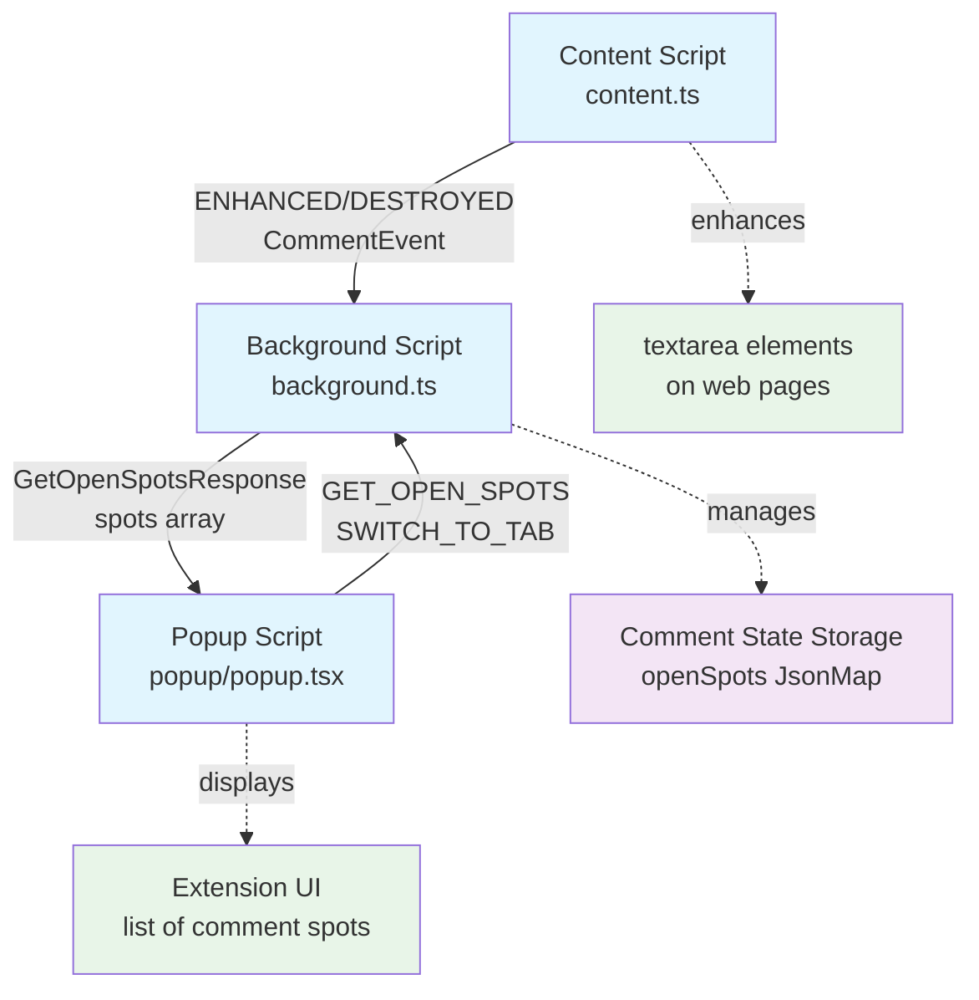

# Gitcasso browser extension

## Developer quickstart

### Hotreload development

- `pnpm install`
- `pnpm run dev`
- open [`chrome://extensions`](chrome://extensions)
- toggle **Developer mode** (top-right)
- click "Load unpacked" (far left)
  - `browser-extension/.output/chrome-mv3-dev`
  - if you can't find `.output`, it's probably hidden, `command+shift+period` will show it
- click the puzzle icon next to the url bar, then pin the Gitcasso icon

### Testing and quality
- `pnpm run biome` - runs `biome check` (lint & formatting)
- `pnpm run biome:fix` - fixes most of what `biome check` finds
- `pnpm run compile` - typechecking
- `pnpm test` - vitest
- `pnpm test -- -u` updates all the snapshots

### Deployment
- `pnpm run build` - build for mv3 for most browsers
- `pnpm run build:firefox` - build mv2 specifically for Firefox

## How it works

This is a [WXT](https://wxt.dev/)-based browser extension that

- finds `textarea` components and decorates them with [overtype](https://overtype.dev/) and [highlight.js](https://highlightjs.org/)
- stores unposted comment drafts, and makes them easy to find via the extension popup

### Entry points

- [`src/entrypoints/content.ts`](src/entrypoints/content.ts) - injected into every webpage
- [`src/entrypoints/background.ts`](src/entrypoints/background.ts) - service worker that manages state and handles messages
- [`src/entrypoints/popup/popup.tsx`](src/entrypoints/popup/popup.tsx) - popup (html/css/tsx) with shadcn/ui table components

Every time a `textarea` shows up on a page, on initial load or later on, it gets passed to a list of `CommentEnhancer`s. Each one gets a turn to say "I can enhance this box!". They show that they can enhance it by returning something non-null in the method `tryToEnhance(textarea: HTMLTextAreaElement): Spot | null`. Later on, that same `Spot` data will be used by the `tableRow(spot: Spot): ReactNode` method to create React components for rich formatting in the popup table.

Those `Spot` values get bundled up with the `HTMLTextAreaElement` itself into an `EnhancedTextarea`, which gets added to the `TextareaRegistry`. At some interval, draft edits get saved by the browser extension.

When the `textarea` gets removed from the page, the `TextareaRegistry` is notified so that the `CommentSpot` can be marked as abandoned or submitted as appropriate.

## Testing

- `npm run playground` gives you a test environment where you can tinker with the popup with various test data, supports hot reload
- `npm run corpus:view` gives you recordings of various web pages which you can see with and without enhancement by the browser extension

### Test Corpus

We maintain a corpus of test pages in two formats for testing the browser extension:

#### HAR Corpus (Automated)

- For testing initial page loads and network requests
- HAR recordings live in `tests/corpus/har/`, complete recordings of the network requests of a single page load
- You can add or change URLs in `tests/corpus/_corpus-index.ts`
- **Recording new HAR files:**
  - `npx playwright codegen https://github.com/login --save-storage=playwright/.auth/gh.json` will store new auth tokens
    - login manually, then close the browser
    - ***these cookies are very sensitive! we only run this script using a test account that has no permissions or memberships to anything, recommend you do the same!***
  - `pnpm run corpus:record:har` records new HAR files using those auth tokens (it needs args, run it with no args for docs)
    - DO NOT COMMIT AND PUSH NEW OR CHANGED HAR files!
    - we try to sanitize these (see `har-record.ts` for details) but there may be important PII in them
    - if you need new HAR files for something, let us know and we will generate them ourselves using a dummy account
    - IF YOUR PR CHANGES OR ADDS HAR FILES WE WILL CLOSE IT. Ask for HAR files and we'll be happy to generate clean ones you can test against.

#### HTML Corpus (Manual)

- For testing post-interaction states (e.g., expanded textareas, modal dialogs, dynamic content)
- HTML snapshots live in `tests/corpus/html/`, manually captured using SingleFile browser extension
- All assets are inlined in a single HTML file by SingleFile
- **Creating new HTML corpus files:**
  1. Navigate to the desired page state (click buttons, expand textareas, etc.)
  2. Use SingleFile browser extension to save the complete page
  3. Save the `.html` file to `tests/corpus/html/` with a descriptive name
  4. Add an entry to `tests/corpus/_corpus-index.ts` with `type: 'html'` and a description of the captured state

#### Viewing Corpus Files

- Run `pnpm run corpus:view` to start the test server at http://localhost:3001
- Select any corpus file to view in two modes:
  - **Clean**: Original page without extension
  - **Gitcasso**: Page with extension injected for testing
- Both HAR and HTML corpus types are supported
